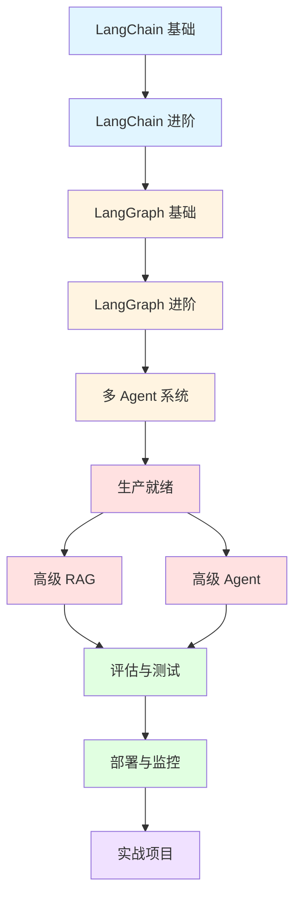

# LangChain & LangGraph 完整学习路线图

> 📚 本路线图涵盖从入门到生产级应用的完整知识体系

---

## 🎯 学习目标

完成本学习路线后，你将能够：
- ✅ 熟练使用 LangChain 构建 LLM 应用
- ✅ 掌握 LangGraph 编排复杂工作流
- ✅ 实现生产级 RAG 系统
- ✅ 构建多 Agent 协作系统
- ✅ 部署和监控 AI 应用

---

## 📖 课程结构

### 阶段 1：LangChain 基础（01_lc_basics）

| 序号 | 主题 | 文件 | 核心知识点 |
|------|------|------|-----------|
| 01 | Hello LangChain | `01_hello_langchain.py` | LangChain vs 原生 SDK、invoke/stream/batch |
| 02 | Prompt Templates | `02_prompt_templates.py` | 模板变量、Few-shot、ChatPromptTemplate |
| 03 | LCEL Chains | `03_lcel_chains.py` | 管道操作符 `|`、Runnable 接口 |
| 04 | Output Parsers | `04_output_parsers.py` | StrOutputParser、PydanticOutputParser |
| 05 | Memory | `05_memory.py` | ConversationBufferMemory、窗口记忆 |
| 06 | Multi-Model | `06_multi_model.py` | 模型切换、configurable_alternatives |

**预计学习时间**：2-3 小时

---

### 阶段 2：LangChain 进阶（02_lc_advanced）

| 序号 | 主题 | 文件 | 核心知识点 |
|------|------|------|-----------|
| 07 | Document Loaders | `07_document_loaders.py` | PDF/Word/Web 加载器 |
| 08 | Text Splitters | `08_text_splitters.py` | CharacterSplitter、RecursiveCharacterSplitter |
| 09 | Embeddings & VectorStore | `09_embeddings_vectorstore.py` | FAISS、Chroma、相似度搜索 |
| 10 | RAG Chain | `10_rag_chain.py` | RetrievalQA、create_retrieval_chain |
| 11 | Tools & Agents | `11_tools_agents.py` | @tool、ReAct Agent、AgentExecutor |
| 12 | Callbacks | `12_callbacks.py` | StdOutCallbackHandler、自定义 Callback |

**预计学习时间**：4-5 小时

**前置知识**：阶段 1 全部内容

---

### 阶段 3：LangGraph 基础（03_lg_basics）

| 序号 | 主题 | 文件 | 核心知识点 |
|------|------|------|-----------|
| 13 | Hello LangGraph | `13_hello_langgraph.py` | StateGraph、Node、Edge、TypedDict |
| 14 | Conditional Edges | `14_conditional_edges.py` | 条件路由、动态分支 |
| 15 | Cycles & Loops | `15_cycles_loops.py` | 循环结构、迭代优化 |
| 16 | Human-in-the-Loop | `16_human_in_the_loop.py` | interrupt()、Command(resume=) |
| 17 | Persistence | `17_persistence.py` | Checkpointer、状态持久化 |

**预计学习时间**：3-4 小时

**前置知识**：阶段 1 + 阶段 2

---

### 阶段 4：LangGraph 进阶（04_lg_advanced）

| 序号 | 主题 | 文件 | 核心知识点 |
|------|------|------|-----------|
| 18 | Subgraphs | `18_subgraphs.py` | 嵌套图、模块化设计 |
| 19 | Parallel Nodes | `19_parallel_nodes.py` | 扇出/扇入、Send API |
| 20 | Tool Node | `20_tool_node.py` | ToolNode、tools_condition |
| 21 | Streaming | `21_streaming.py` | stream(mode="updates/values")、astream_events |
| 22 | Supervisor Pattern | `22_supervisor_pattern.py` | 协调者模式、多 Agent 调度 |
| 23 | Network Pattern | `23_network_pattern.py` | 去中心化协作、消息传递 |

**预计学习时间**：4-5 小时

**前置知识**：阶段 3 全部内容

---

### 阶段 5：多 Agent 系统（05_multi_agent）

| 序号 | 主题 | 文件 | 核心知识点 |
|------|------|------|-----------|
| 24 | Research Team | `24_research_team.py` | 研究员+分析师+写作者协作 |
| 25 | Code Review Team | `25_code_review_team.py` | 代码审查工作流 |
| 26 | Production Patterns | `26_production_patterns.py` | 重试、日志、LangSmith 追踪 |

**预计学习时间**：3-4 小时

**前置知识**：阶段 4 全部内容

---

### 阶段 6：生产就绪（06_production_ready）⭐ 新增

| 序号 | 主题 | 文件 | 核心知识点 |
|------|------|------|-----------|
| 27 | Caching Layer | `27_caching_layer.py` | InMemoryCache、SQLiteCache、语义缓存 |
| 28 | Retry & Fallback | `28_retry_and_fallback.py` | 指数退避、主备切换、优雅降级 |
| 29 | Debugging & Visualization | `29_debugging_and_visualization.py` | Mermaid 导出、LangGraph Studio |

**预计学习时间**：3-4 小时

**前置知识**：阶段 5 全部内容

---

### 阶段 7：高级 RAG 技巧（07_advanced_rag）⭐ 新增

| 序号 | 主题 | 文件 | 核心知识点 |
|------|------|------|-----------|
| 30 | Advanced RAG Techniques | `30_advanced_rag_techniques.py` | 查询重写、混合检索、重排序、多跳推理 |

**预计学习时间**：3-4 小时

**前置知识**：阶段 2（09-10）+ 阶段 3

---

### 阶段 8：高级 Agent 模式（08_advanced_agents）⭐ 新增

| 序号 | 主题 | 文件 | 核心知识点 |
|------|------|------|-----------|
| 31 | Advanced Agent Patterns | `31_advanced_agent_patterns.py` | Plan-and-Execute、Self-Reflection、ReWOO |

**预计学习时间**：3-4 小时

**前置知识**：阶段 5 + 阶段 4（20）

---

### 阶段 9：部署与监控（09_deployment）⭐ 新增

| 序号 | 主题 | 文件 | 核心知识点 |
|------|------|------|-----------|
| 32 | Deployment & Monitoring | `32_deployment_and_monitoring.py` | FastAPI、Docker、K8s、水平扩展 |

**预计学习时间**：4-5 小时

**前置知识**：阶段 6 全部内容

---

### 阶段 10：评估与测试（10_evaluation）⭐ 新增

| 序号 | 主题 | 文件 | 核心知识点 |
|------|------|------|-----------|
| 33 | Evaluation & Testing | `33_evaluation_and_testing.py` | RAGAS、单元测试、A/B 测试 |

**预计学习时间**：3-4 小时

**前置知识**：阶段 7 + 阶段 9

---

### 阶段 11：实战项目（11_projects）⭐ 新增

| 序号 | 主题 | 文件 | 核心知识点 |
|------|------|------|-----------|
| 34 | Customer Service Bot | `34_project_customer_service_bot.py` | 意图识别、RAG、人工升级、反馈收集 |

**预计学习时间**：5-6 小时

**前置知识**：所有阶段

---

## 🗺️ 学习路径建议

### 路径 A：快速上手（2-3 天）

适合想快速构建简单应用的学习者。

```
阶段 1（基础） → 阶段 2（RAG + Agent） → 阶段 3（LangGraph 基础）
```

**目标**：能构建基础的问答机器人和简单 Agent

**预计时间**：10-12 小时

---

### 路径 B：系统学习（1-2 周）

适合想全面掌握 LangChain/LangGraph 的学习者。

```
阶段 1-5（原有内容） → 阶段 6（生产就绪） → 阶段 7-8（高级技巧）
```

**目标**：能独立设计和实现复杂的 AI 工作流

**预计时间**：30-40 小时

---

### 路径 C：生产级应用（3-4 周）

适合准备将 AI 应用部署到生产环境的学习者。

```
路径 B 全部内容 → 阶段 9（部署） → 阶段 10（评估） → 阶段 11（项目）
```

**目标**：能构建、部署、监控生产级 AI 系统

**预计时间**：50-60 小时

---

## 📊 知识地图



---

## 🎓 核心能力矩阵

完成学习后，你将掌握以下能力：

### LangChain 核心能力

| 能力 | 掌握程度 | 相关文件 |
|------|---------|---------|
| 模型调用与切换 | ⭐⭐⭐⭐⭐ | 01, 06 |
| Prompt 工程 | ⭐⭐⭐⭐⭐ | 02 |
| LCEL 链式调用 | ⭐⭐⭐⭐⭐ | 03 |
| RAG 系统构建 | ⭐⭐⭐⭐⭐ | 07-10, 30 |
| Agent 开发 | ⭐⭐⭐⭐⭐ | 11, 31 |
| 输出解析 | ⭐⭐⭐⭐ | 04 |
| 记忆管理 | ⭐⭐⭐⭐ | 05 |
| Callback 监控 | ⭐⭐⭐⭐ | 12 |

### LangGraph 核心能力

| 能力 | 掌握程度 | 相关文件 |
|------|---------|---------|
| StateGraph 构建 | ⭐⭐⭐⭐⭐ | 13 |
| 条件路由 | ⭐⭐⭐⭐⭐ | 14 |
| 循环与迭代 | ⭐⭐⭐⭐⭐ | 15 |
| Human-in-the-Loop | ⭐⭐⭐⭐⭐ | 16 |
| 状态持久化 | ⭐⭐⭐⭐⭐ | 17 |
| 子图与模块化 | ⭐⭐⭐⭐ | 18 |
| 并行执行 | ⭐⭐⭐⭐ | 19 |
| 流式输出 | ⭐⭐⭐⭐ | 21 |
| 多 Agent 协作 | ⭐⭐⭐⭐⭐ | 22-26 |

### 生产级能力

| 能力 | 掌握程度 | 相关文件 |
|------|---------|---------|
| 缓存优化 | ⭐⭐⭐⭐⭐ | 27 |
| 重试与降级 | ⭐⭐⭐⭐⭐ | 28 |
| 调试与可视化 | ⭐⭐⭐⭐⭐ | 29 |
| API 服务化 | ⭐⭐⭐⭐⭐ | 32 |
| Docker 部署 | ⭐⭐⭐⭐⭐ | 32 |
| 水平扩展 | ⭐⭐⭐⭐ | 32 |
| RAGAS 评估 | ⭐⭐⭐⭐⭐ | 33 |
| 单元测试 | ⭐⭐⭐⭐⭐ | 33 |
| A/B 测试 | ⭐⭐⭐⭐ | 33 |

---

## 💡 学习建议

### 1. 循序渐进

不要跳过基础直接看高级内容。每个阶段都是后续阶段的基础。

### 2. 动手实践

**重要**：不要只读代码，一定要亲自运行并修改实验！

```bash
# 为每个示例创建虚拟环境
cd langchain_langgraph
python -m venv venv
source venv/bin/activate  # Linux/Mac
# 或
venv\Scripts\activate     # Windows

# 安装依赖
pip install -r requirements.txt

# 运行示例
python 01_lc_basics/01_hello_langchain.py
```

### 3. 理解原理

每个文件开头的文档字符串都包含：
- 学习目标
- 核心概念
- 前置知识

认真阅读这些内容，理解"为什么"比记住"怎么做"更重要。

### 4. 做笔记

建议为每个阶段创建学习笔记，记录：
- 关键概念
- 代码片段
- 遇到的问题和解决方案

### 5. 构建项目

学完阶段 5 后，尝试自己构建一个小项目：
- 个人知识库助手
- 代码审查助手
- 智能客服机器人

---

## 🔗 相关资源

### 官方文档

- [LangChain 文档](https://python.langchain.com/)
- [LangGraph 文档](https://langchain-ai.github.io/langgraph/)
- [LangSmith 文档](https://docs.smith.langchain.com/)

### 社区资源

- [LangChain GitHub](https://github.com/langchain-ai/langchain)
- [LangGraph GitHub](https://github.com/langchain-ai/langgraph)
- [LangChain Discord](https://discord.gg/langchain)

### 进阶阅读

- [RAG 最佳实践](https://blog.langchain.dev/rag-best-practices/)
- [Agent 设计模式](https://langchain-ai.github.io/langgraph/concepts/agentic_concepts/)
- [生产级 LLM 应用](https://python.langchain.com/docs/guides/productionization/)

---

## 📝 检查清单

完成学习后，你应该能够回答以下问题：

### LangChain 基础

- [ ] LangChain 的核心价值是什么？
- [ ] 如何使用 LCEL 构建链？
- [ ] Prompt Template 有哪些类型？
- [ ] 如何实现多轮对话记忆？

### RAG 系统

- [ ] RAG 的完整流程是什么？
- [ ] 如何选择合适的文本分割策略？
- [ ] 向量数据库的工作原理？
- [ ] 如何评估 RAG 系统的质量？

### Agent 开发

- [ ] ReAct 模式的工作流程？
- [ ] 如何定义和注册工具？
- [ ] Agent 与普通 Chain 的区别？
- [ ] 如何处理 Agent 的错误？

### LangGraph

- [ ] StateGraph 的三个核心要素？
- [ ] 如何实现条件分支？
- [ ] Human-in-the-Loop 的应用场景？
- [ ] 如何持久化图的状态？

### 多 Agent 系统

- [ ] Supervisor 模式的工作原理？
- [ ] 如何设计 Agent 间的通信？
- [ ] 如何处理 Agent 冲突？
- [ ] 如何优化多 Agent 性能？

### 生产部署

- [ ] 如何为 LangGraph 添加缓存？
- [ ] 重试机制的最佳实践？
- [ ] 如何容器化部署？
- [ ] 如何监控系统健康？

### 评估测试

- [ ] RAGAS 的核心指标有哪些？
- [ ] 如何编写单元测试？
- [ ] A/B 测试的实施步骤？
- [ ] 如何建立持续评估体系？

---

## 🎉 结语

恭喜你完成了 LangChain & LangGraph 的完整学习路线！

现在你已经具备了：
- ✅ 构建复杂 AI 应用的能力
- ✅ 部署生产级系统的知识
- ✅ 持续优化和改进的方法

**下一步**：
1. 选择一个真实项目，应用所学知识
2. 参与开源社区，贡献代码或文档
3. 持续关注最新发展，AI 领域变化很快

祝你在 AI 应用开发的道路上越走越远！🚀

---

**最后更新**：2026-04-27  
**维护者**：Lingma AI Assistant
